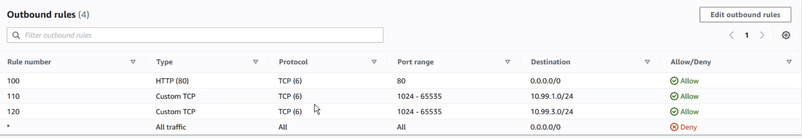
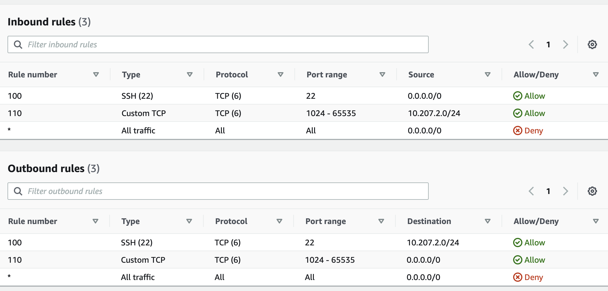

# AWS - Virtual Private Cloud (VPC)
Amazon VPC is a service that lets you launch AWS resources in a logically isolated virtual network that you define. You can control your virtual network environment including selection of your own IP address range, creation of subnets, and configuration of route tables and network gateways. You can use both IPv4 and IPv6 for most resources in your virtual private cloud, helping to ensure secure and easy access to resources and applications.

## Internet Gateway (IGW)
An Internet gateway can transfer communications between an enterprise network and the Internet. The gateway converts information, data or other communications from one protocol or format to another. A router may perform some of the functions of a gateway.

- They provide a target in your VPC route tables for internet-routable traffic
- perform network address translation (NAT) for instances that have been assigned public IPv4 addresses

## Subnet 
A subnet, or subnetwork, is a segmented piece of a larger network. One goal of a subnet is to split a large network into a grouping of smaller, interconnected networks to help minimize traffic.

- Groups of isolated resources can be placed in each segment of a VPC's IP address ranges
- Can be used to limit IP's used

## Route Table 
A route table contains a set of rules, called routes, that are used to determine where network traffic from your subnet or gateway is directed. 

## Network Access Control List (ACL) 
Network Access Control (NAC) is a computer networking solution that uses a set of protocols to define and implement a policy that describes how to secure access to network nodes by devices when they initially attempt to access the network.

- limiting user access
- blocks access from endpoint devices that do not comply with corporate security policies.

# Creating and Setting up VPC 

## Step 1: Create a VPC
1. On the AWS Dashboard search for **VPC** and click on `Your VCP`.

2. Select `Create VPC`

3. Create a **Name tag** , add an **IPv4 CIDRblock** and click `Create VPC`

In my case I will be using `10.104.0.0` for my IPv4 CIDR

## Step 2: Create Internet Gateway
1.  Select `Internet Gateways` on the dashboard thenlect `Create Internet gateway` 

2. Add a Name tag then click `Create Internet Gateway` 

3. Select `action` and `Attach VPC`. Attach the VPC you created previously.

4. Select `Attach Internet Gateway`

## Step 3: Creating a Subnet

1. Click on `Subnet` onthe left toolbar then select `Create subnet` 

2. Create a public, private and bastion subnet:

- Select the VPC you previously created 
- **Public**: CIDR block IP changes slightly by adding 1 instad of 0 in the 3rd optec

- **Private**: CIDR block IP changes slightly by adding 2 instad of 0 in the 3rd optec

- **Bastion**: CIDR block IP changes slightly by adding 2 instad of 0 in the 3rd optec

## Step 4: Creating a Route Table

1. On the left hand toolbar click on `route table`

2. Create a route table 

3. Select the route table and click `Action` then `Edit routes`

4. Then add a destination and target. The target I used was the internet gateway created earlier. Then click `save routes`

5. Click on subnet associations and then `edit subnet associations`. Select the public and bastion subnet and click on save.

## Step 4: Creating Network ACL

1. On the left hand side toolbar under security click on Network ACLs and then click create network ACL.

2. Create a public private and bastion NACL and select your VPC 

3. On the public nacl add the following inbound rules:

4. On the public nacl add the following outbound rules:

5.  In the `subnet associations` select the public subnet created earlier and select edit

6. On the private nacl add the following inbound rules:

7. On the private nacl add the following outbound rules:

8. Create Bastion Nacl with inbound and oubund rules:

## Step 5: Creating security groups

1. Create a security group for the app:

Inbound rules:
- HTTP: Anywhere
- SSH: My IP

2. Create security group for the database

Inbound rules:

- Custom: Port 27017-> DB ip

3. Create a security group for the bastion

Inbound: SSH 

**Step 6: Create the EC2 instances**

1. Create the app EC2 instance

- AMI: Ubuntu
- Instance type: t2 micro
- Instance Details: Your VPC -> Public Subnet -> Assign public ip enabled
- Security Group: app security group

2. Create the db EC2 instance

- AMI: Ubuntu
- Instance type: t2 micro
- Instance Details: Your VPC -> Private Subnet -> Assign public ip disabled
- Security Group: db security group

3. Create a bastion instance

- AMI: Ubuntu
- Instance type: t2 micro
- Instance Details: Your VPC -> Bastion Subnet -> Assign public ip enabled
- Security Group: bastion security group

**Step 7: Copy key and ssh into dB**

1. Command to copy key:
`scp -i eng89_devops.pem eng89_devops.pem ubuntu@52.50.176.145:/home/ubuntu/.ssh/ `

2. Now you should be able to ssh into the db server from the bastions server 

**Step 8: Deploy app**
